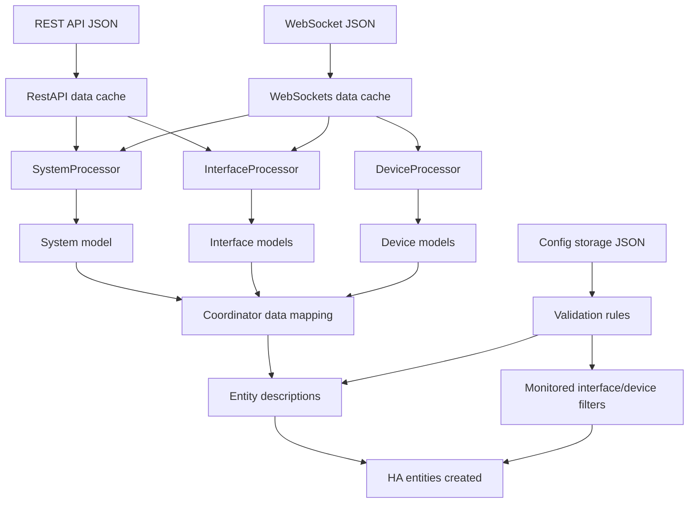

# Sensor Creation From EdgeOS JSON

This document explains how Home Assistant entities are created from EdgeOS JSON payloads, and which sensors are generated from each JSON section.

## JSON Sources

The integration builds entities from two JSON streams:

- REST API JSON
  - `GET /api/edge/get.json` (stored as `API_DATA_SYSTEM`)
  - `GET /api/edge/data.json?data=sys_info` (stored as `API_DATA_SYS_INFO`)
  - `GET /api/edge/data.json?data=dhcp_stats` (stored as `API_DATA_DHCP_STATS`)
  - `GET /api/edge/data.json?data=dhcp_leases` (stored as `API_DATA_DHCP_LEASES`)
- WebSocket JSON topics
  - `system-stats`
  - `discover`
  - `interfaces`
  - `export`

## Entity Creation Flow

## How Creation Is Decided

Entity descriptors are static definitions. Runtime filtering decides which of these are actually created:

- Platform + device type must match.
- Validation rules are applied:
  - `monitored`: only create when monitored in config storage JSON.
  - `admin-only`: only create for admin user.
  - `non-admin-only`: only create for non-admin user.

Practical effect:

- Interface traffic/error/packet/rate sensors are created only when that interface is monitored.
- Device traffic/rate/tracker sensors are created only when that device is monitored.
- Interface status entity type changes by user role (switch for admin, binary sensor for non-admin).

## Sensor Mapping By JSON Section

### System Sensors

- From WebSocket `system-stats`:
  - `cpu_usage`
  - `ram_usage`
  - `last_restart` (computed from uptime)
- From REST `dhcp_stats`:
  - `unknown_devices`
- From REST `sys_info`:
  - `firmware` (binary sensor state + version/url attributes)

### Smart Queue Sensors

Smart Queue data is built from:

- REST `get.json` system tree:
  - Detects `smart-queue` / `smart_queue` blocks.
  - Aggregates queue configuration values.
- WebSocket `interfaces` topic:
  - Aggregates queue runtime stats from `imq*` interfaces.

Created Smart Queue sensors:

- Parameter/config sensors:
  - `smart_queue_total`
  - `smart_queue_enabled`
  - `smart_queue_interfaces`
  - `smart_queue_upload_limit`
  - `smart_queue_download_limit`
- Statistics sensors:
  - `smart_queue_rx_rate`
  - `smart_queue_tx_rate`
  - `smart_queue_rx_traffic`
  - `smart_queue_tx_traffic`
  - `smart_queue_rx_dropped`
  - `smart_queue_tx_dropped`
  - `smart_queue_rx_errors`
  - `smart_queue_tx_errors`
  - `smart_queue_rx_packets`
  - `smart_queue_tx_packets`

Advanced Smart Queue settings:

- The `smart_queue_total` sensor now exposes attributes derived from each queue's advanced options:
  - `advanced_settings`: map of `<interface>:<queue_name>` to advanced key/value options found in JSON.
  - `advanced_settings_count`: total number of queue entries with advanced options.

### Interface Sensors (monitored interfaces only)

Built primarily from WebSocket `interfaces` stats, with static/interface metadata from REST `get.json`:

- `interface_received_rate`
- `interface_sent_rate`
- `interface_received_traffic`
- `interface_sent_traffic`
- `interface_received_dropped`
- `interface_sent_dropped`
- `interface_received_errors`
- `interface_sent_errors`
- `interface_received_packets`
- `interface_sent_packets`
- `interface_connected` (binary sensor)

### Device Sensors (monitored devices only)

Built from WebSocket `export` topic and discovery data:

- `device_received_rate`
- `device_sent_rate`
- `device_received_traffic`
- `device_sent_traffic`
- `device_tracker`

## Notes

- Unit conversion for data size/rate sensors is applied at sensor entity level using configured unit (`b`, `kb`, `mb`).
- Discovery signals trigger entity creation when system/device/interface objects are first seen.
- Sensor values are supplied by coordinator getter methods that map entity keys to processor model fields.
